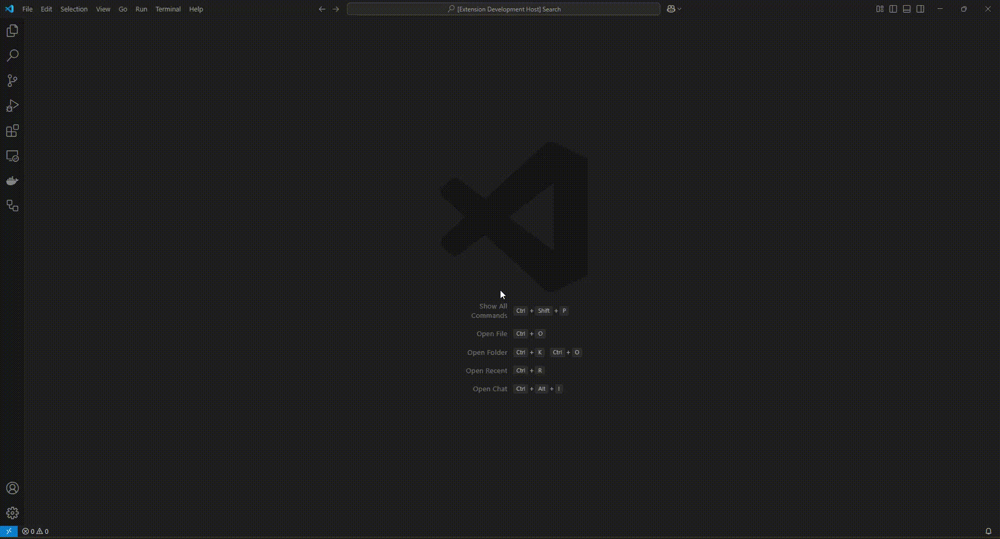

# fhir-resource-diagram-viewer-vscode
A VS Code extension for viewing FHIR® resource instances as diagrams.

## Dependencies
[PlantUML extension](https://marketplace.visualstudio.com/items?itemName=jebbs.plantuml)

## Usage
1. Open up a JSON file with the resource content;
2. Execute one of the extension commands by using the Command Palette ("View/Command Palette..." or Ctrl+Shift+P):
    * "fhir-resource-diagram-viewer-vscode: View the resource content as a diagram" (for viewing all attributes);
    * "fhir-resource-diagram-viewer-vscode: View resource references as a diagram" (for viewing the "resourceType" attribute, the "id" attribute, and attributes with references);
3. View the PlantUML code and diagram generated from the original content.

## Release Notes

### 1.0.0

- Initial release.
